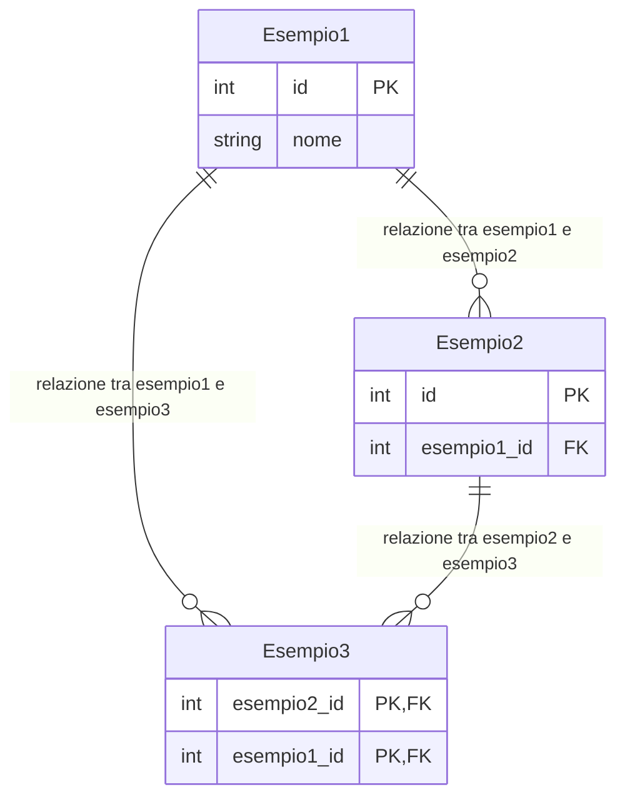

```mermaid
erDiagram
    Esempio1 {
        int id PK
        string nome
    }
    Esempio2 {
        int id PK
        int esempio1_id FK
    }

    Esempio3 {
        int esempio2_id PK, FK
        int esempio1_id PK, FK
    }

    Esempio1 ||--o{ Esempio2 : "relazione tra esempio1 e esempio2"
    Esempio1 ||--o{ Esempio3 : "relazione tra esempio1 e esempio3"
    Esempio2 ||--o{ Esempio3 : "relazione tra esempio2 e esempio3"
```
