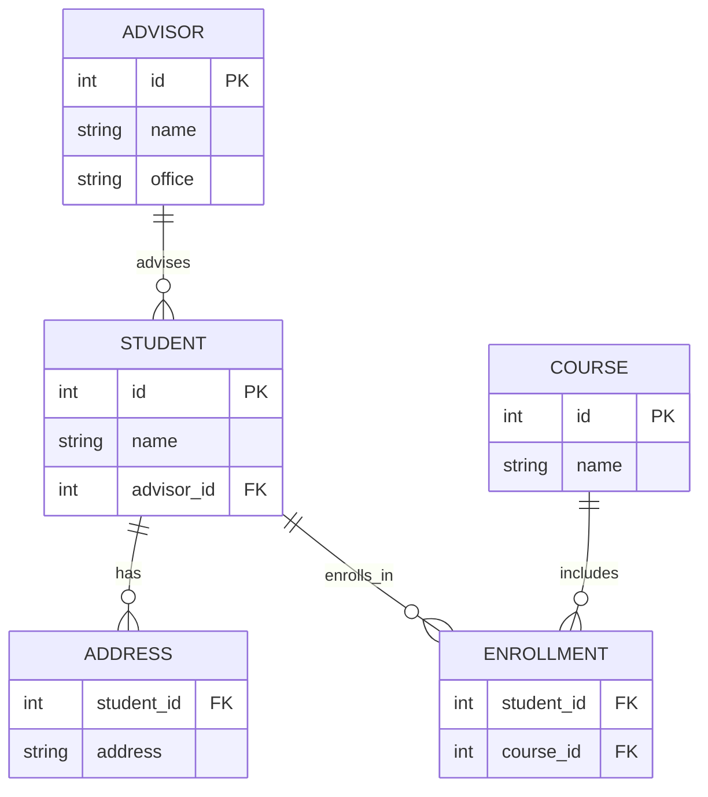

### TESTO DELL'ESERCIZIO

Considera il seguente modello logico di un database che non rispetta la Prima Forma Normale (1NF), la Seconda Forma Normale (2NF) e la Terza Forma Normale (3NF): 

### DIAGRAMMA ER



### TABELLE

- **STUDENT**: id `PK`, name, addresses, courses, advisor_id, advisor_name, advisor_office
- **COURSE**: id `PK`, name, student_ids

In questo modello:
- La tabella `STUDENT` contiene gli attributi `addresses` e `courses` che possono avere valori multipli (liste di indirizzi e corsi), violando la 1NF.
- La tabella `STUDENT` contiene anche attributi `advisor_name` e `advisor_office` che dipendono parzialmente dalla chiave primaria `id`, violando la 2NF.
- La tabella `COURSE` contiene l'attributo `student_ids` che può avere valori multipli (lista di ID degli studenti iscritti al corso), violando la 1NF.

### NORMALIZZAZIONE
### 1. PRIMA FORMA NORMALE (1NF)

### Tabelle

- **STUDENT**: id `PK`, name, advisor_id `FK` → ADVISOR.id
- **ADDRESS**: student_id `FK` → STUDENT.id, address, `PK`(student_id, address)
- **ENROLLMENT**: student_id `FK` → STUDENT.id, course_id `FK` → COURSE.id, `PK`(student_id, course_id)
- **ADVISOR**: id `PK`, name, office
- **COURSE**: id `PK`, name

### 2. SECONDA FORMA NORMALE (2NF)

Il modello già rispetta la 2NF poiché tutte le tabelle hanno chiavi primarie semplici o chiavi composte che non hanno dipendenze parziali.

### 3. TERZA FORMA NORMALE (3NF)

Il modello già rispetta la 3NF poiché non ci sono dipendenze transitive tra gli attributi non chiave.

### CREATE QUERY

```sql

CREATE DATABASE university_system;

USE university_system;

CREATE TABLE STUDENT (
    id INT PRIMARY KEY,
    name VARCHAR(100) NOT NULL,
    advisor_id INT,
    FOREIGN KEY (advisor_id) REFERENCES ADVISOR(id)
);

CREATE TABLE ADDRESS (
    student_id INT,
    address VARCHAR(255) NOT NULL,
    PRIMARY KEY (student_id, address),
    FOREIGN KEY (student_id) REFERENCES STUDENT(id)
);

CREATE TABLE ENROLLMENT (
    student_id INT,
    course_id INT,
    PRIMARY KEY (student_id, course_id),
    FOREIGN KEY (student_id) REFERENCES STUDENT(id),
    FOREIGN KEY (course_id) REFERENCES COURSE(id)
);

CREATE TABLE ADVISOR (
    id INT PRIMARY KEY,
    name VARCHAR(100) NOT NULL,
    office VARCHAR(100) NOT NULL
);

CREATE TABLE COURSE (
    id INT PRIMARY KEY,
    name VARCHAR(100) NOT NULL
);
```
### INSERT QUERY

```sql

INSERT INTO STUDENT (id, name, advisor_id) VALUES
(1, 'Alice', 1),
(2, 'Bob', 2),
(3, 'Charlie', 1);

INSERT INTO ADDRESS (student_id, address) VALUES
(1, '123 Main St'),
(2, '456 Elm St'),
(3, '789 Oak St');

INSERT INTO ENROLLMENT (student_id, course_id) VALUES
(1, 1),
(2, 1),
(3, 2);

INSERT INTO ADVISOR (id, name, office) VALUES
(1, 'Dr. Smith', 'Room 101'),
(2, 'Dr. Johnson', 'Room 102');

INSERT INTO COURSE (id, name) VALUES
(1, 'Computer Science'),
(2, 'Mathematics');
```

