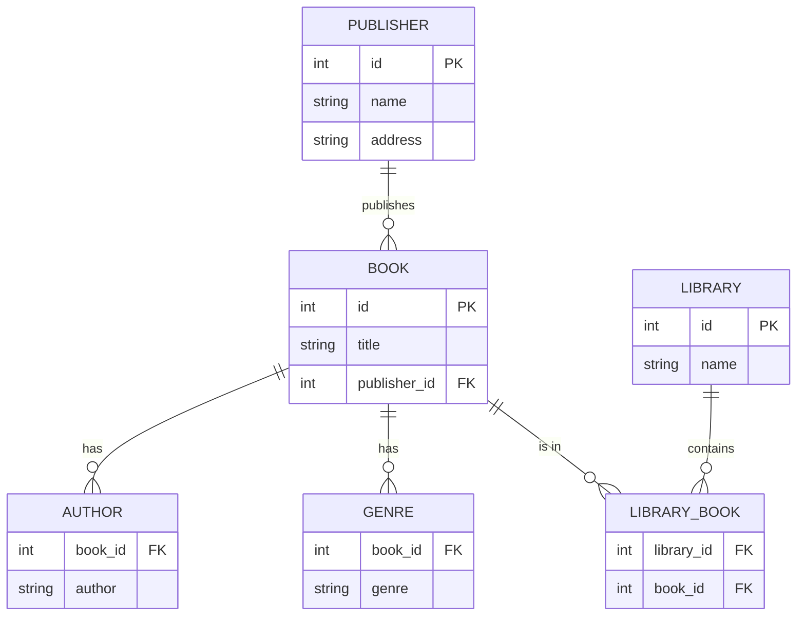

### TESTO DELL'ESERCIZIO

Considera il seguente modello logico di un database che non rispetta la Prima Forma Normale (1NF), la Seconda Forma Normale (2NF) e la Terza Forma Normale (3NF): 

### DIAGRAMMA ER


### TABELLE

- **BOOK**: id `PK`, title, authors, genres, publisher_id, publisher_name, publisher_address
- **LIBRARY**: id `PK`, name, book_ids

In questo modello:
- La tabella `BOOK` contiene gli attributi `authors` e `genres` che possono avere valori multipli (liste di autori e generi), violando la 1NF.
- La tabella `BOOK` contiene anche attributi `publisher_name` e `publisher_address` che dipendono parzialmente dalla chiave primaria `id`, violando la 2NF.
- La tabella `LIBRARY` contiene l'attributo `book_ids` che può avere valori multipli (lista di ID dei libri presenti nella biblioteca), violando la 1NF.

### NORMALIZZAZIONE

### 1. PRIMA FORMA NORMALE (1NF)

- **BOOK**: id `PK`, title, publisher_id `FK` → PUBLISHER.id
- **AUTHOR**: book_id `FK` → BOOK.id, author, `PK`(book_id, author)
- **GENRE**: book_id `FK` → BOOK.id, genre, `PK`(book_id, genre)
- **PUBLISHER**: id `PK`, name, address
- **LIBRARY**: id `PK`, name
- **LIBRARY_BOOK**: library_id `FK` → LIBRARY.id, book_id `FK` → BOOK.id, `PK`(library_id, book_id)

### 2. SECONDA FORMA NORMALE (2NF)

Il modello già rispetta la 2NF poiché tutte le tabelle hanno chiavi primarie semplici o chiavi composte che non hanno dipendenze parziali.

### 3. TERZA FORMA NORMALE (3NF)

Il modello già rispetta la 3NF poiché non ci sono dipendenze transitive tra gli attributi non chiave.

### CREATE QUERY

```sql 
CREATE DATABASE library_system;

USE library_system;

CREATE TABLE BOOK (
    id INT PRIMARY KEY,
    title VARCHAR(255) NOT NULL,
    publisher_id INT,
    FOREIGN KEY (publisher_id) REFERENCES PUBLISHER(id)
);

CREATE TABLE AUTHOR (
    book_id INT,
    author VARCHAR(255) NOT NULL,
    PRIMARY KEY (book_id, author),
    FOREIGN KEY (book_id) REFERENCES BOOK(id)
);

CREATE TABLE GENRE (
    book_id INT,
    genre VARCHAR(255) NOT NULL,
    PRIMARY KEY (book_id, genre),
    FOREIGN KEY (book_id) REFERENCES BOOK(id)
);

CREATE TABLE PUBLISHER (
    id INT PRIMARY KEY,
    name VARCHAR(255) NOT NULL,
    address VARCHAR(255) NOT NULL
);

CREATE TABLE LIBRARY (
    id INT PRIMARY KEY,
    name VARCHAR(255) NOT NULL
);

CREATE TABLE LIBRARY_BOOK (
    library_id INT,
    book_id INT,
    PRIMARY KEY (library_id, book_id),
    FOREIGN KEY (library_id) REFERENCES LIBRARY(id),
    FOREIGN KEY (book_id) REFERENCES BOOK(id)
);
```

### INSERT QUERY

```sql

INSERT INTO PUBLISHER (id, name, address) VALUES
(1, 'Penguin Books', '123 Publisher Street, New York'),
(2, 'HarperCollins', '456 Book Avenue, London');

INSERT INTO BOOK (id, title, publisher_id) VALUES
(1, 'The Great Gatsby', 1),
(2, '1984', 2),
(3, 'To Kill a Mockingbird', 1);

INSERT INTO AUTHOR (book_id, author) VALUES
(1, 'F. Scott Fitzgerald'),
(2, 'George Orwell'),
(3, 'Harper Lee');

INSERT INTO GENRE (book_id, genre) VALUES
(1, 'Novel'),
(2, 'Dystopian'),
(3, 'Historical Fiction');

INSERT INTO LIBRARY (id, name) VALUES
(1, 'Central Library'),
(2, 'West End Library');

INSERT INTO LIBRARY_BOOK (library_id, book_id) VALUES
(1, 1),
(1, 2),
(2, 3);
```
