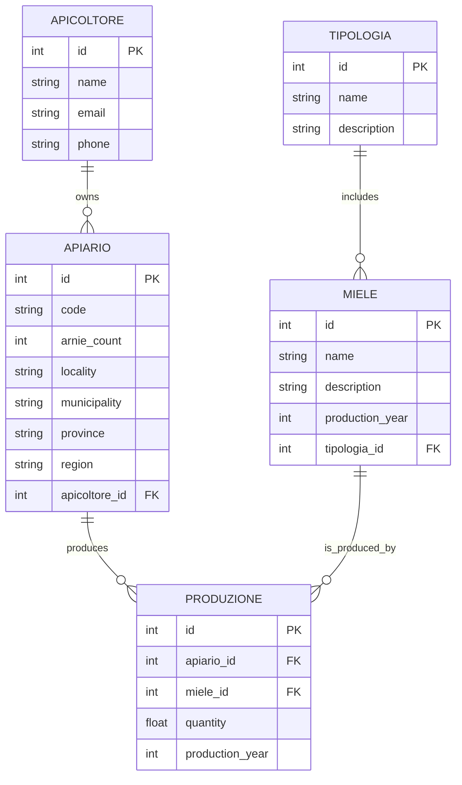

### TESTO DELL'ESERCIZIO 
 
Tra i maggiori paesi europei produttori di miele vi è l’Italia, che vanta oltre 60 diverse varietà di miele, molte delle quali del tutto uniche proprio in virtù delle diverse peculiarità locali e territoriali (dalle fioriture alpine a quelle della macchia mediterranea, dalle coste adriatiche alle isole). La produzione è gestita da circa 60 mila apicoltori.
Considerata l’importanza di tale patrimonio economico, naturalistico e anche culturale, le principali associazioni di settore hanno convenuto sulla necessità di realizzare una banca dati online che consenta la raccolta, gestione e consultazione dei dati relativi alla produzione dei mieli italiani.
Per potere operare una distinzione tra i vari mieli sono state individuate le seguenti tipologie:
Mieli ad identità nazionale, ossia prodotti in molte o tutte le regioni italiane
Mieli ad identità regionale, ossia presenti in una o più specifiche regioni
Mieli ad identità territoriale, ossia mieli presenti in alcuni specifici territori
Mieli D.O.P., ossia a denominazione di origine protetta
Ogni miele ha quindi una sua denominazione ed appartiene ad una certa tipologia (ad esempio il Millefiori è un miele ad identità nazionale, Erica è un miele ad identità regionale, Asfodelo ad identità territoriale, il Miele delle Dolomiti Bellunesi è un miele DOP). Il miele viene prodotto in apiari: un apiario è costituito da una o più arnie (struttura costruita dall’uomo per l’allevamento delle api) tra loro vicine.
Il progetto prevede che ogni apicoltore fornisca i dati per ciascun miele prodotto annualmente attraverso i propri apiari.
Per tenere conto delle specificità territoriali e delle produzioni locali, ciascun apiario, che produce una certa quantità annuale di un unico miele, è individuato attraverso le seguenti informazioni: codice identificativo, numero di arnie che lo compongono, località, comune, provincia, regione.

### DIAGRAMMA ER



### PROGETTAZIONE LOGICA
 
### TABELLE PRINCIPALI

- **APICOLTORE**: id `PK`, name, email, phone
- **TIPOLOGIA**: id `PK`, name, description
- **MIELE**: id `PK`, name, description, production_year, tipologia_id `FK` → TIPOLOGIA.id
- **APIARIO**: id `PK`, code, arnie_count, locality, municipality, province, region, apicoltore_id `FK` → APICOLTORE.id
  
### TABELLE DI ASSOCIAZIONE

- **PRODUZIONE**: id `PK`, apiario_id `FK`→ APIARIO.id , miele_id `FK`→ MIELE.id, quanity, production_year

### NORMALIZZAZIONE

### CREATE QUERY

```sql
CREATE TABLE APICOLTORE (
    id INT PRIMARY KEY,
    name VARCHAR(100) NOT NULL,
    email VARCHAR(100) NOT NULL UNIQUE,
    phone VARCHAR(50)
);
CREATE TABLE TIPOLOGIA (
    id INT PRIMARY KEY,
    name VARCHAR(100) NOT NULL,
    description TEXT
);
CREATE TABLE MIELE (
    id INT PRIMARY KEY,
    name VARCHAR(100) NOT NULL,
    description TEXT,
    production_year INT NOT NULL,
    tipologia_id INT,
    FOREIGN KEY (tipologia_id) REFERENCES TIPOLOGIA(id)
);
CREATE TABLE APIARIO (
    id INT PRIMARY KEY,
    code VARCHAR(50) NOT NULL,
    arnie_count INT NOT NULL,
    locality VARCHAR(100),
    municipality VARCHAR(100),
    province VARCHAR(100),
    region VARCHAR(100),
    apicoltore_id INT,
    FOREIGN KEY (apicoltore_id) REFERENCES APICOLTORE(id)
);
CREATE TABLE PRODUZIONE (
    id INT PRIMARY KEY,
    apiario_id INT,
    miele_id INT,
    quantity FLOAT NOT NULL,
    production_year INT NOT NULL,
    FOREIGN KEY (apiario_id) REFERENCES APIARIO(id),
    FOREIGN KEY (miele_id) REFERENCES MIELE(id)
);
```

### INSERT QUERY

```sql
INSERT INTO APICOLTORE (id, name, email, phone) VALUES
(1, 'Giuseppe Rossi', 'giuseppe@example.com', '3331234567'),
(2, 'Marco Bianchi', 'marco@example.com', '3337654321');

INSERT INTO TIPOLOGIA (id, name, description) VALUES
(1, 'Nazionale', 'Mieli ad identità nazionale'),
(2, 'Regionale', 'Mieli ad identità regionale'),
(3, 'Territoriale', 'Mieli ad identità territoriale'),
(4, 'DOP', 'Mieli a denominazione di origine protetta');

INSERT INTO MIELE (id, name, description, production_year, tipologia_id) VALUES
(1, 'Millefiori', 'Un miele a base di fiori vari', 2023, 1),
(2, 'Erica', 'Miele prodotto con fiori di erica', 2023, 2),
(3, 'Asfodelo', 'Miele di asfodelo', 2023, 3),
(4, 'Miele delle Dolomiti Bellunesi', 'Miele DOP delle Dolomiti Bellunesi', 2023, 4);

INSERT INTO APIARIO (id, code, arnie_count, locality, municipality, province, region, apicoltore_id) VALUES
(1, 'API001', 10, 'Alta Val di Susa', 'Susa', 'Torino', 'Piemonte', 1),
(2, 'API002', 15, 'Parco Nazionale della Majella', 'Caramanico Terme', 'Pescara', 'Abruzzo', 2);

INSERT INTO PRODUZIONE (id, apiario_id, miele_id, quantity, production_year) VALUES
(1, 1, 1, 100.5, 2023),
(2, 1, 2, 50.3, 2023),
(3, 2, 3, 200.0, 2023),
(4, 2, 4, 150.0, 2023);
```
