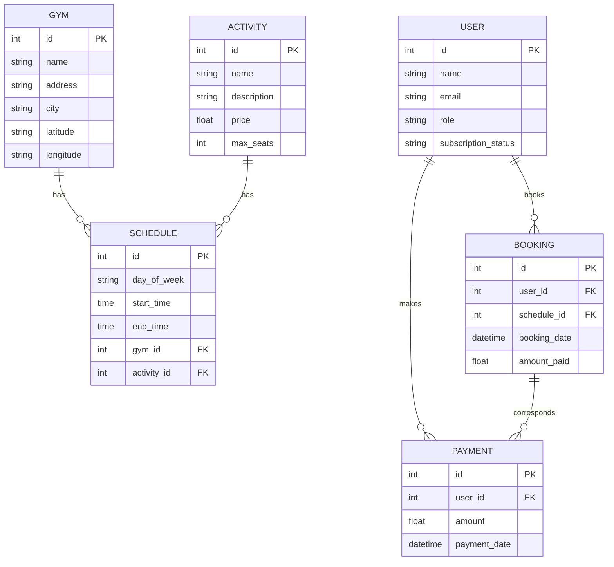

### TESTO DELL'ESERCIZIO

La società SportOvunque, proprietaria di diverse palestre di fitness in alcune città d’Italia, vuole lanciare un servizio innovativo che dia la possibilità alle persone che viaggiano di poter accedere,
con un unico abbonamento, ad attività offerte da palestre gestite anche da altre società, in tutta Italia.
A tale scopo SportOvunque ha preso accordi con palestre interessate ad aderire a questa iniziativa su tutto il territorio nazionale. 
Le palestre che hanno aderito praticheranno tariffe di ingresso agevolate riservate agli abbonati di SportOvunque.
L’abbonamento a questo servizio può essere acquistato sul portale web di SportOvunque, dove i potenziali clienti possono registrarsi pagando on-line la relativa quota annuale.
Ogni palestra che aderisce all’iniziativa dovrà caricare sul portale i propri dati, comprensivi di indirizzo, città e coordinate geografiche.
Dovrà poi caricare anche la propria offerta di fitness: per ogni tipologia standardizzata di attività (es: Sala macchine, GAG, Zumba, Pilates ecc) resa disponibile agli abbonati, 
indicherà i giorni della settimana (lunedì, martedì, ...) in cui le attività vengono svolte, ciascuna con gli orari in cui possono essere prenotate, il relativo prezzo convenzionato
e il numero massimo di posti disponibili.
Un abbonato potrà prenotare attività presso una qualsiasi palestra tra quelle presenti sul portale: individuerà la palestra, l’attività, il giorno della settimana e l’orario,
e sceglierà la data specifica di suo interesse.
Se in quella data sono già state effettuate prenotazioni in numero pari al massimo dei posti disponibili per quell’attività, l’attività non sarà prenotabile.
Altrimenti la prenotazione verrà regolarmente registrata, e l’abbonato pagherà on-line il relativo prezzo a SportOvunque; quest’ultima provvederà poi a versare mensilmente,
alle varie palestre che hanno aderito al servizio, gli incassi relativi alle attività prenotate.

### DIAGRAMMA ER



### PROGETTAZIONE LOGICA

### TABELLE PRINCIPALI

- **USER**: id `PK`, name, email, role, subscription_status
- **GYM**: id `PK`, name, address, city, latitude, longitude
- **ACTIVITY**: id `PK`, name, description, price, max_seats
- **SCHEDULE**: id `PK`, day_of_week, start_time, end_time, gym_id `FK` → GYM.id, activity_id `FK` → ACTIVITY.id
- **BOOKING**:  id `PK`, user_id `FK` → USER.id, schedule_id `FK` → SCHEDULE.id, booking_date, amount_paid
- **PAYMENT**: id `PK`, user_id `FK` → USER.id, amount, payment_date

### TABELLE DI ASSOCIAZIONE

- **BOOKING**: user_id `FK` → USER.id, schedule_id `FK` → SCHEDULE.id
- **PAYMENT**: user_id `FK` → USER.id

### NORMALIZZAZIONE

- La 1NF richiede che ogni colonna contenga solo valori atomici e che ogni riga sia unica.
- La 2NF richiede che il database sia in 1NF e che tutti gli attributi non chiave dipendano completamente dalla chiave primaria.
- La 3NF richiede che il database sia in 2NF e che non ci siano dipendenze transitive tra gli attributi non chiave.

Il database rispetta la Prima Forma Normale (1NF), la Seconda Forma Normale (2NF) e la Terza Forma Normale (3NF).

### CREATE QUERY

```sql
CREATE DATABASE sportovunque;

USE sportovunque;

CREATE TABLE USER (
    id INT PRIMARY KEY AUTO_INCREMENT,
    name VARCHAR(100) NOT NULL,
    email VARCHAR(100) NOT NULL UNIQUE,
    role VARCHAR(50) NOT NULL,
    subscription_status ENUM('active', 'inactive') NOT NULL
);

CREATE TABLE GYM (
    id INT PRIMARY KEY AUTO_INCREMENT,
    name VARCHAR(100) NOT NULL,
    address VARCHAR(255) NOT NULL,
    city VARCHAR(100) NOT NULL,
    latitude DECIMAL(9, 6),
    longitude DECIMAL(9, 6)
);

CREATE TABLE ACTIVITY (
    id INT PRIMARY KEY AUTO_INCREMENT,
    name VARCHAR(100) NOT NULL,
    description TEXT,
    price DECIMAL(10, 2) NOT NULL,
    max_seats INT NOT NULL
);

CREATE TABLE SCHEDULE (
    id INT PRIMARY KEY AUTO_INCREMENT,
    day_of_week ENUM('monday', 'tuesday', 'wednesday', 'thursday', 'friday', 'saturday', 'sunday') NOT NULL,
    start_time TIME NOT NULL,
    end_time TIME NOT NULL,
    gym_id INT,
    activity_id INT,
    FOREIGN KEY (gym_id) REFERENCES GYM(id),
    FOREIGN KEY (activity_id) REFERENCES ACTIVITY(id)
);

CREATE TABLE BOOKING (
    id INT PRIMARY KEY AUTO_INCREMENT,
    user_id INT,
    schedule_id INT,
    booking_date DATETIME NOT NULL,
    amount_paid DECIMAL(10, 2) NOT NULL,
    FOREIGN KEY (user_id) REFERENCES USER(id),
    FOREIGN KEY (schedule_id) REFERENCES SCHEDULE(id)
);

CREATE TABLE PAYMENT (
    id INT PRIMARY KEY AUTO_INCREMENT,
    user_id INT,
    amount DECIMAL(10, 2) NOT NULL,
    payment_date DATETIME NOT NULL,
    FOREIGN KEY (user_id) REFERENCES USER(id)
);
```

### INSERT QUERY

```sql
INSERT INTO USER (name, email, role, subscription_status) VALUES
('Marco Rossi', 'marco.rossi@email.com', 'abbonato', 'active'),
('Anna Bianchi', 'anna.bianchi@email.com', 'abbonato', 'active');

INSERT INTO GYM (name, address, city, latitude, longitude) VALUES
('Gym A', 'Via Roma 123, Milano', 'Milano', 45.4641, 9.1919),
('Gym B', 'Viale delle Alpi 56, Torino', 'Torino', 45.0703, 7.6869);

INSERT INTO ACTIVITY (name, description, price, max_seats) VALUES
('Sala macchine', 'Attività di allenamento con attrezzature fitness', 10.00, 20),
('Zumba', 'Lezione di danza e fitness', 12.00, 15);

INSERT INTO SCHEDULE (day_of_week, start_time, end_time, gym_id, activity_id) VALUES
('monday', '08:00:00', '09:00:00', 1, 1),
('tuesday', '09:00:00', '10:00:00', 2, 2);

INSERT INTO BOOKING (user_id, schedule_id, booking_date, amount_paid) VALUES
(1, 1, '2025-01-05 08:00:00', 10.00),
(2, 2, '2025-01-06 09:00:00', 12.00);

INSERT INTO PAYMENT (user_id, amount, payment_date) VALUES
(1, 10.00, '2025-01-01 10:00:00'),
(2, 12.00, '2025-01-01 11:00:00');
```
