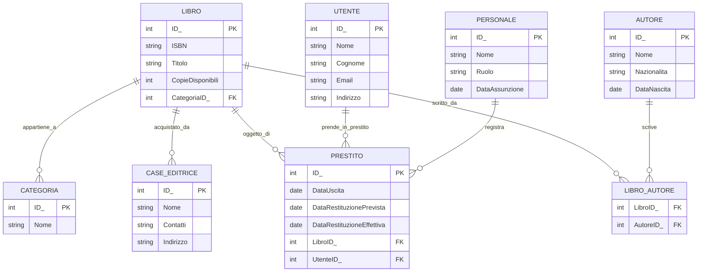

### TESTO DELL'ESERCIZIO

La biblioteca comunale necessita di un sistema informativo per gestire le proprie attività quotidiane. I libri vengono acquistati da diverse case editrici e possono essere scritti da uno o più autori. Ogni volume appartiene a una specifica categoria per facilitarne la ricerca e l'organizzazione sugli scaffali.
Gli iscritti alla biblioteca possono prendere in prestito i libri, rispettando le date di restituzione previste. Il personale della biblioteca si occupa di registrare i prestiti e i rientri, tenendo traccia delle date e dello stato dei volumi. Per ogni prestito viene registrata la data di uscita e quella prevista per il rientro.
È importante mantenere informazioni dettagliate sia sui libri (come ISBN e numero di copie disponibili) che sugli utenti iscritti. Del personale si tengono informazioni relative alla data di assunzione e al ruolo ricoperto. Per gli autori si registra anche la nazionalità e la data di nascita, mentre delle case editrici servono i contatti e l'indirizzo per gli ordini.

### ANALISI DELLA REALTA' DI RIFERIMENTO

- **Utenti principali:**
    - libri
    - case_editrici
    - autori
    - categoria
    - utenti
    - personale
    - prestito    
- **Funzionalità principali:**
    - Gestione dei libri e delle loro informazioni
    - Gestione delle case editrici e degli autori
    - Associazione tra libri e categorie
    - Gestione dei prestiti (data di uscita e restituzione)
    - Monitoraggio delle copie disponibili per ciascun libro
    - Gestione delle informazioni sugli utenti e sul personale
- **Requisiti di sistema:**
    - Sistema di gestione dei libri e prestiti
    - Gestione delle relazioni tra autori, case editrici, libri e categorie
    - Sistema per registrare prestiti e rientri con data di uscita e restituzione
    - Gestione delle informazioni dettagliate su autori, case editrici, e personale
- **Considerazioni aggiuntive:**
    - La piattaforma dovrà essere scalabile e sicura
    - Interfaccia utente semplice e intuitiva per facilitare l'uso da parte di personale e utenti

### DIAGRAMMA ER



### PROGETTAZIONE LOGICA

### TABELLE PRINCIPALI

- **LIBRO**: id `PK`, ISBN, titolo, copie_disponibili, categoria_id `FK` → CATEGORIA.id, case_editrice_id `FK` → CASE_EDITRICE.id
- **CASE_EDITRICE**: id `PK`, nome, contatti, indirizzo
- **AUTORE**: id `PK`, nome, nazionalità, data_nascita
- **CATEGORIA**: id `PK`, nome
- **UTENTE**: id `PK`, nome, cognome, email, indirizzo
- **PERSONALE**: id `PK`, nome, ruolo, data_assunzione
- **PRESTITO**: id `PK`, data_uscita, data_restituzione_prevista, data_restituzione_effettiva, libro_id `FK` → LIBRO.id, utente_id `FK` → UTENTE.id
- **LIBRO_AUTORE**: libro_id `FK` → LIBRO.id, autore_id `FK` → AUTORE.id

### TABELLE DI ASSOCIAZIONE

- **LIBRO_AUTORE**: libro_id `FK` → LIBRO.id, autore_id `FK` → AUTORE.id

### NORMALIZZAZIONE

    - 1NF: Ogni attributo contiene valori atomici e ogni riga è unica.
    - 2NF: Il database è in 1NF e tutti gli attributi non chiave dipendono completamente dalla chiave primaria.
    - 3NF: Il database è in 2NF e non ci sono dipendenze transitive tra gli attributi non chiave.


### CREATE QUERY

```sql

CREATE TABLE LIBRO (
    id INT PRIMARY KEY,
    isbn VARCHAR(20) NOT NULL,
    titolo VARCHAR(255),
    copie_disponibili INT,
    categoria_id INT,
    case_editrice_id INT,
    FOREIGN KEY (categoria_id) REFERENCES CATEGORIA(id),
    FOREIGN KEY (case_editrice_id) REFERENCES CASE_EDITRICE(id)
);

CREATE TABLE CASE_EDITRICE (
    id INT PRIMARY KEY,
    nome VARCHAR(255),
    contatti VARCHAR(255),
    indirizzo TEXT
);

CREATE TABLE AUTORE (
    id INT PRIMARY KEY,
    nome VARCHAR(255),
    nazionalita VARCHAR(255),
    data_nascita DATE
);

CREATE TABLE CATEGORIA (
    id INT PRIMARY KEY,
    nome VARCHAR(255)
);

CREATE TABLE UTENTE (
    id INT PRIMARY KEY,
    nome VARCHAR(255),
    cognome VARCHAR(255),
    email VARCHAR(255),
    indirizzo TEXT
);

CREATE TABLE PERSONALE (
    id INT PRIMARY KEY,
    nome VARCHAR(255),
    ruolo VARCHAR(255),
    data_assunzione DATE
);

CREATE TABLE PRESTITO (
    id INT PRIMARY KEY,
    data_uscita DATE,
    data_restituzione_prevista DATE,
    data_restituzione_effettiva DATE,
    libro_id INT,
    utente_id INT,
    FOREIGN KEY (libro_id) REFERENCES LIBRO(id),
    FOREIGN KEY (utente_id) REFERENCES UTENTE(id)
);

CREATE TABLE LIBRO_AUTORE (
    libro_id INT,
    autore_id INT,
    PRIMARY KEY (libro_id, autore_id),
    FOREIGN KEY (libro_id) REFERENCES LIBRO(id),
    FOREIGN KEY (autore_id) REFERENCES AUTORE(id)
);

```

### INSERT QUERY

```sql

INSERT INTO CASE_EDITRICE (id, nome, contatti, indirizzo) VALUES
(1, 'Casa Editrice A', 'info@casaeditricea.com', 'Via Roma, 12'),
(2, 'Casa Editrice B', 'contact@casaeditriceb.com', 'Corso Milano, 34');

INSERT INTO CATEGORIA (id, nome) VALUES
(1, 'Narrativa'),
(2, 'Saggistica');

INSERT INTO LIBRO (id, isbn, titolo, copie_disponibili, categoria_id, case_editrice_id) VALUES
(1, '1234567890', 'Il Grande Libro', 5, 1, 1),
(2, '0987654321', 'Storia del Mondo', 3, 2, 2);

INSERT INTO AUTORE (id, nome, nazionalita, data_nascita) VALUES
(1, 'Giovanni Rossi', 'Italiana', '1970-05-10'),
(2, 'Maria Verdi', 'Italiana', '1980-08-15');

INSERT INTO LIBRO_AUTORE (libro_id, autore_id) VALUES
(1, 1),
(2, 2);

INSERT INTO UTENTE (id, nome, cognome, email, indirizzo) VALUES
(1, 'Luca', 'Bianchi', 'luca.bianchi@example.com', 'Via Milano 123'),
(2, 'Sara', 'Neri', 'sara.neri@example.com', 'Via Torino 456');

INSERT INTO PERSONALE (id, nome, ruolo, data_assunzione) VALUES
(1, 'Marco', 'Bibliotecario', '2015-01-01'),
(2, 'Anna', 'Assistente', '2020-05-15');

INSERT INTO PRESTITO (id, data_uscita, data_restituzione_prevista, data_restituzione_effettiva, libro_id, utente_id) VALUES
(1, '2023-01-10', '2023-01-20', '2023-01-19', 1, 1),
(2, '2023-01-12', '2023-01-22', '2023-01-23', 2, 2);

```

