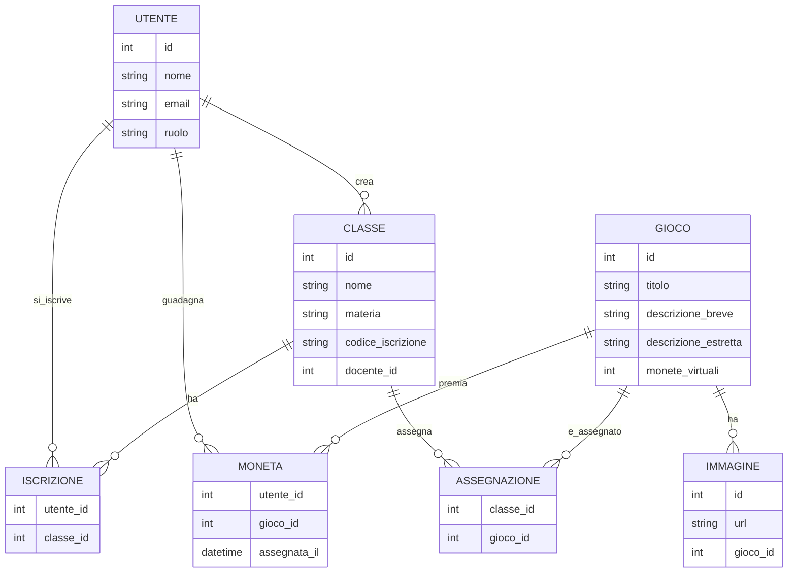
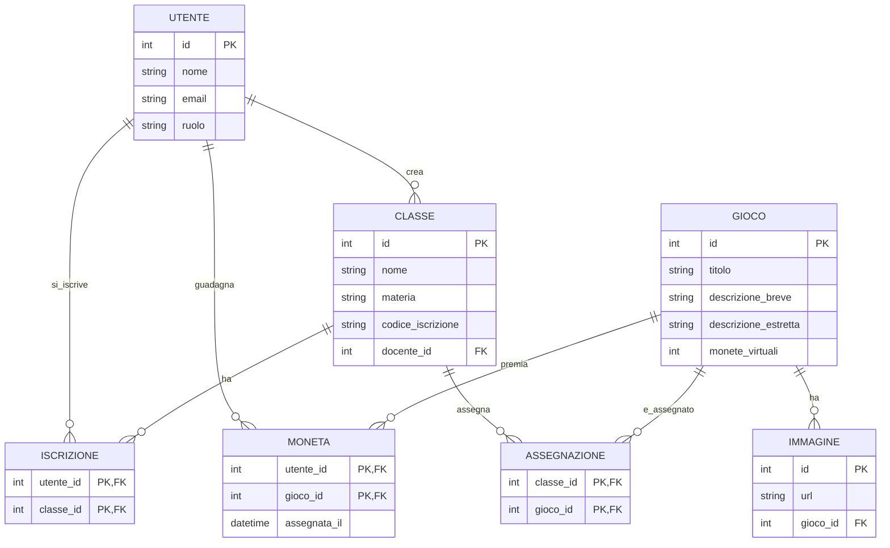

### TESTO DELL'ESERCIZIO
 
Una scuola vuole progettare una piattaforma web per la fruizione di educational games (ovvero videogiochi in ambito educativo), per migliorare l’apprendimento nelle varie materie.
Ciascun docente, una volta completata la registrazione alla piattaforma, può creare una o più classi virtuali (identificate da un nome e una materia di pertinenza: es. 3B, matematica) 
e aprire l’iscrizione alle singole classi ai propri studenti tramite la condivisione del codice iscrizione (link o QR-code).
Nella piattaforma è presente il catalogo dei videogiochi didattici, classificati in base ad un elenco di argomenti prestabiliti (es: triangoli, legge di Ohm, verismo …): 
ciascun docente può selezionare uno o più videogiochi per includerli in una classe virtuale.
Per ogni videogioco è presente un titolo, una descrizione breve di massimo 160 caratteri, una descrizione estesa, il numero di “monete virtuali” che si possono raccogliere all’interno del gioco e fino a tre immagini sul gioco.
Uno studente si iscriverà sulla piattaforma alle classi cui è stato invitato (es: 3B matematica, 3B italiano ...) tramite il relativo codice iscrizione, e all’interno di ciascuna classe troverà i link ai videogiochi didattici proposti dal docente.
Svolgendo ciascun videogioco, lo studente potrà raccogliere sequenzialmente delle monete tramite quiz o attività da completare.
Una moneta è un riconoscimento che viene assegnato nel videogioco al raggiungimento di determinati traguardi educativi graduali.
Attraverso il numero di monete, raccolte man mano da uno studente in ciascun videogioco di quella classe, si può determinare una classifica per ciascun gioco e anche una classifica generale comprensiva di tutti i giochi della classe; 
il docente può quindi seguire l’andamento degli studenti e supportarli individualmente nel completamento della raccolta delle monete.

### ANALISI DELLA REALTA' DI RIFERIMENTO

- **Utenti principali:**
  - Docenti
  - Studenti
- **Funzionalità principali:**
  - Registrazione e autenticazione degli utenti
  - Creazione e gestione di classi virtuali
  - Generazione e condivisione di codici di iscrizione
  - Catalogo dei videogiochi didattici con dettagli (titolo, descrizione, monete virtuali, immagini)
  - Assegnazione di giochi alle classi
  - Monitoraggio del progresso degli studenti tramite monete
  - Classifiche individuali e generali
  - Supporto per quiz e attività all'interno dei giochi
- **Requisiti di sistema:**
  - Interfaccia web intuitiva e responsiva
  - Gestione sicura dei dati degli utenti
  - Scalabilità per supportare numerosi utenti e classi
  - Integrazione con strumenti di condivisione (link, QR-code)
- **Considerazioni aggiuntive:**
  - Accessibilità per diversi dispositivi (desktop, tablet, mobile)
  - Facilità di navigazione e usabilità per studenti di diverse età
  - Sistema di notifiche per aggiornamenti e progressi

### DIAGRAMMA ER

### VERSIONE 1



### VERSIONE 2



### PROGETTAZIONE LOGICA

### TABELLE PRINCIPALI

- **UTENTE**: id `PK`, nome, email, ruolo
- **CLASSE**: id `PK`, nome, materia, codice_iscrizione, docente_id `FK` → UTENTE.id
- **GIOCO**: id `PK`, titolo, descrizione_breve, descrizione_estretta, monete_virtuali
- **IMMAGINE**: id `PK`, url, gioco_id `FK` → GIOCO.id

### TABELLE DI ASSOCIAZIONE

- **ISCRIZIONE**: utente_id `FK` → UTENTE.id, classe_id `FK` → CLASSE.id, `PK`(utente_id, classe_id)
- **ASSEGNAZIONE**: classe_id `FK` → CLASSE.id, gioco_id `FK` → GIOCO.id, `PK`(classe_id, gioco_id)
- **MONETA**: utente_id `FK` → UTENTE.id, gioco_id `FK` → GIOCO.id, assegnata_il, `PK`(utente_id, gioco_id)

### NORMALIZZAZIONE

- La 1NF richiede che ogni colonna contenga solo valori atomici e che ogni riga sia unica.(non possono esserci liste o valori multipli, e tutto dipende dalla chiave primaria)
- La 2NF richiede che il database sia in 1NF e che tutti gli attributi non chiave dipendano completamente dalla chiave primaria.(tutto dipende dalla chiave primaria)
- La 3NF richiede che il database sia in 2NF e che non ci siano dipendenze transitive tra gli attributi non chiave.(gli attributi non possono dipendere da attributi non chiave)

Il database rispetta la Prima Forma Normale (1NF), la Seconda Forma Normale (2NF) e la Terza Forma Normale (3NF).

### CREATE QUERY

```sql
CREATE DATABASE giochi_educativi;

USE giochi_educativi;

CREATE TABLE UTENTE (
    id INT PRIMARY KEY,
    nome VARCHAR(100) NOT NULL,
    email VARCHAR(100) NOT NULL UNIQUE,
    ruolo VARCHAR(50) NOT NULL
);

CREATE TABLE CLASSE (
    id INT PRIMARY KEY,
    nome VARCHAR(100) NOT NULL,
    materia VARCHAR(100) NOT NULL,
    codice_iscrizione VARCHAR(50) NOT NULL UNIQUE,
    docente_id INT,
    FOREIGN KEY (docente_id) REFERENCES UTENTE(id)
);

CREATE TABLE GIOCO (
    id INT PRIMARY KEY,
    titolo VARCHAR(150) NOT NULL,
    descrizione_breve TEXT,
    descrizione_estretta TEXT,
    monete_virtuali INT NOT NULL
);

CREATE TABLE IMMAGINE (
    id INT PRIMARY KEY,
    url VARCHAR(255) NOT NULL UNIQUE,
    gioco_id INT,
    FOREIGN KEY (gioco_id) REFERENCES GIOCO(id)
);

CREATE TABLE ISCRIZIONE (
    utente_id INT,
    classe_id INT,
    PRIMARY KEY (utente_id, classe_id),
    FOREIGN KEY (utente_id) REFERENCES UTENTE(id),
    FOREIGN KEY (classe_id) REFERENCES CLASSE(id)
);

CREATE TABLE ASSEGNAZIONE (
    classe_id INT,
    gioco_id INT,
    PRIMARY KEY (classe_id, gioco_id),
    FOREIGN KEY (classe_id) REFERENCES CLASSE(id),
    FOREIGN KEY (gioco_id) REFERENCES GIOCO(id)
);

CREATE TABLE MONETA (
    utente_id INT,
    gioco_id INT,
    assegnata_il DATETIME NOT NULL,
    PRIMARY KEY (utente_id, gioco_id),
    FOREIGN KEY (utente_id) REFERENCES UTENTE(id),
    FOREIGN KEY (gioco_id) REFERENCES GIOCO(id)
);

```

### INSERT QUERY

```sql
INSERT INTO UTENTE (id, nome, email, ruolo) VALUES
(1, 'Alice', 'alice@example.com', 'docente'),
(2, 'Bob', 'bob@example.com', 'studente'),
(3, 'Charlie', 'charlie@example.com', 'studente');

INSERT INTO CLASSE (id, nome, materia, codice_iscrizione, docente_id) VALUES
(1, 'Matematica 101', 'Matematica', 'MATH101', 1),
(2, 'Scienze 101', 'Scienze', 'SCI101', 1);

INSERT INTO GIOCO (id, titolo, descrizione_breve, descrizione_estretta, monete_virtuali) VALUES
(1, 'Quiz Matematico', 'Un quiz sulla matematica di base', 'Questo gioco include una serie di domande sull'aritmetica di base.', 10),
(2, 'Avventura Scientifica', 'Esplora il mondo della scienza', 'Questo gioco ti porta in un’avventura attraverso vari concetti scientifici.', 15);

INSERT INTO IMMAGINE (id, url, gioco_id) VALUES
(1, 'http://example.com/images/quiz_matematico.png', 1),
(2, 'http://example.com/images/avventura_scientifica.png', 2);

INSERT INTO ISCRIZIONE (utente_id, classe_id) VALUES
(2, 1),
(3, 1),
(2, 2);

INSERT INTO ASSEGNAZIONE (classe_id, gioco_id) VALUES
(1, 1),
(2, 2);

INSERT INTO MONETA (utente_id, gioco_id, assegnata_il) VALUES
(2, 1, '2023-10-01 10:00:00'),
(3, 1, '2023-10-02 11:00:00'),
(2, 2, '2023-10-03 12:00:00');

```
