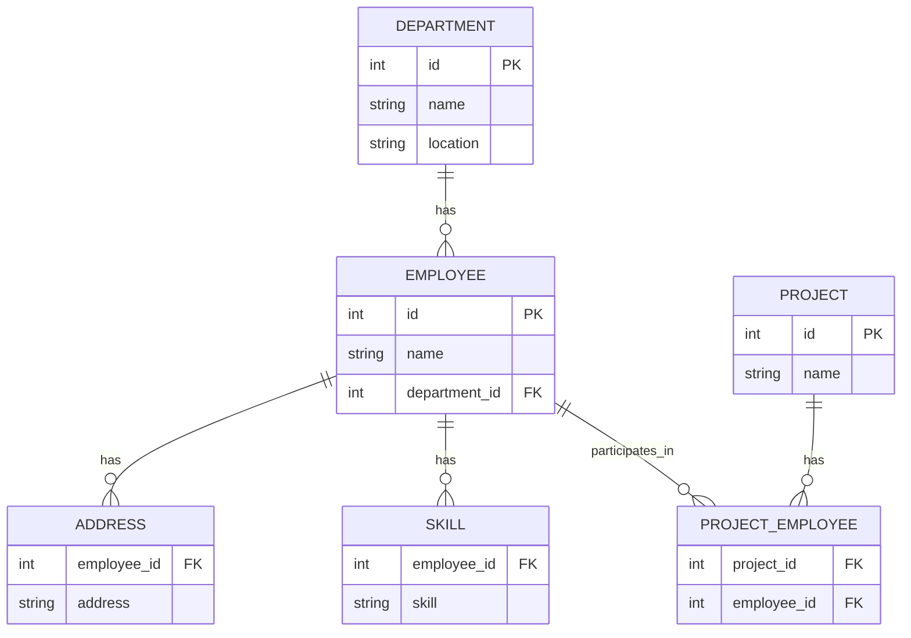

### TESTO DELL'ESERCIZIO

Considera il seguente modello logico di un database che non rispetta la Prima Forma Normale (1NF), la Seconda Forma Normale (2NF) e la Terza Forma Normale (3NF):


### DIAGRAMMA ER



### PROGETTAZIONE LOGICA

### TABELLE

- **EMPLOYEE**: id `PK`, name, addresses, skills, department_id, department_name, department_location
- **PROJECT**: id `PK`, name, employee_ids

In questo modello:
- La tabella `EMPLOYEE` contiene gli attributi `addresses` e `skills` che possono avere valori multipli (liste di indirizzi e competenze), violando la 1NF.
- La tabella `EMPLOYEE` contiene anche attributi `department_name` e `department_location` che dipendono parzialmente dalla chiave primaria `id`, violando la 2NF.
- La tabella `PROJECT` contiene l'attributo `employee_ids` che può avere valori multipli (lista di ID dei dipendenti assegnati al progetto), violando la 1NF.

### NORMALIZZAZIONE

### 1. PRIMA FORMA NORMALE (1FN)

- **EMPLOYEE**: id `PK`, name, department_id `FK` → DEPARTMENT.id
- **ADDRESS**: employee_id `FK` → EMPLOYEE.id, address, `PK`(employee_id, address)
- **SKILL**: employee_id `FK` → EMPLOYEE.id, skill, `PK`(employee_id, skill)
- **DEPARTMENT**: id `PK`, name, location
- **PROJECT**: id `PK`, name
- **PROJECT_EMPLOYEE**: project_id `FK` → PROJECT.id, employee_id `FK` → EMPLOYEE.id, `PK`(project_id, employee_id)

### 2. SECONDA FORMA NORMALE (2FN)

Il modello già rispetta la 2NF poiché tutte le tabelle hanno chiavi primarie semplici o chiavi composte che non hanno dipendenze parziali.

### 3. TERZA FORMA NORMALE (3FN)

Il modello già rispetta la 3NF poiché non ci sono dipendenze transitive tra gli attributi non chiave.

### CREATE QUERY

```sql

CREATE DATABASE company_resources;

USE company_resources;

CREATE TABLE EMPLOYEE (
    id INT PRIMARY KEY,
    name VARCHAR(100) NOT NULL,
    department_id INT,
    FOREIGN KEY (department_id) REFERENCES DEPARTMENT(id)
);

CREATE TABLE ADDRESS (
    employee_id INT,
    address VARCHAR(255) NOT NULL,
    PRIMARY KEY (employee_id, address),
    FOREIGN KEY (employee_id) REFERENCES EMPLOYEE(id)
);

CREATE TABLE SKILL (
    employee_id INT,
    skill VARCHAR(100) NOT NULL,
    PRIMARY KEY (employee_id, skill),
    FOREIGN KEY (employee_id) REFERENCES EMPLOYEE(id)
);

CREATE TABLE DEPARTMENT (
    id INT PRIMARY KEY,
    name VARCHAR(100) NOT NULL,
    location VARCHAR(100) NOT NULL
);

CREATE TABLE PROJECT (
    id INT PRIMARY KEY,
    name VARCHAR(100) NOT NULL
);

CREATE TABLE PROJECT_EMPLOYEE (
    project_id INT,
    employee_id INT,
    PRIMARY KEY (project_id, employee_id),
    FOREIGN KEY (project_id) REFERENCES PROJECT(id),
    FOREIGN KEY (employee_id) REFERENCES EMPLOYEE(id)
);
```

### INSERT QUERY

```sql

INSERT INTO EMPLOYEE (id, name, department_id) VALUES
(1, 'Alice', 1),
(2, 'Bob', 2),
(3, 'Charlie', 1);

INSERT INTO ADDRESS (employee_id, address) VALUES
(1, '123 Main St'),
(2, '456 Elm St'),
(3, '789 Oak St');

INSERT INTO SKILL (employee_id, skill) VALUES
(1, 'Java'),
(2, 'Python'),
(3, 'JavaScript');

INSERT INTO DEPARTMENT (id, name, location) VALUES
(1, 'Engineering', 'Building A'),
(2, 'Marketing', 'Building B');

INSERT INTO PROJECT (id, name) VALUES
(1, 'Project Alpha'),
(2, 'Project Beta');

INSERT INTO PROJECT_EMPLOYEE (project_id, employee_id) VALUES
(1, 1),
(1, 2),
(2, 3);
```
